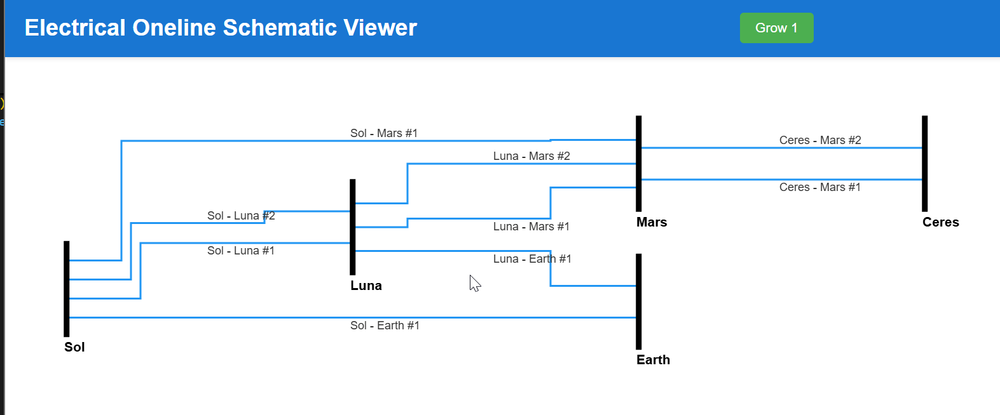

# Electrical Oneline Schematic Viewer

Simple example of using the ELK layered layout to draw electrical onelines. 

ELK took me a while to learn because it just computes the layout coordinates, 
and leaves the rendering up to you.



## Overview

- Reads network data from `netlist.json`
- Compute graph layout using layered algorithm with ELK.js
- Render graph with [Konva](https://konvajs.org/)
- Add basic canvas interactions
- Grow and redraw the network with buttons to simualte new data coming in from an endpoint. 

## Quickstart

Install:
```bash
npm install
```

Run:
```bash
npm run dev
```

Open you [localhost](http://localhost:5173)

